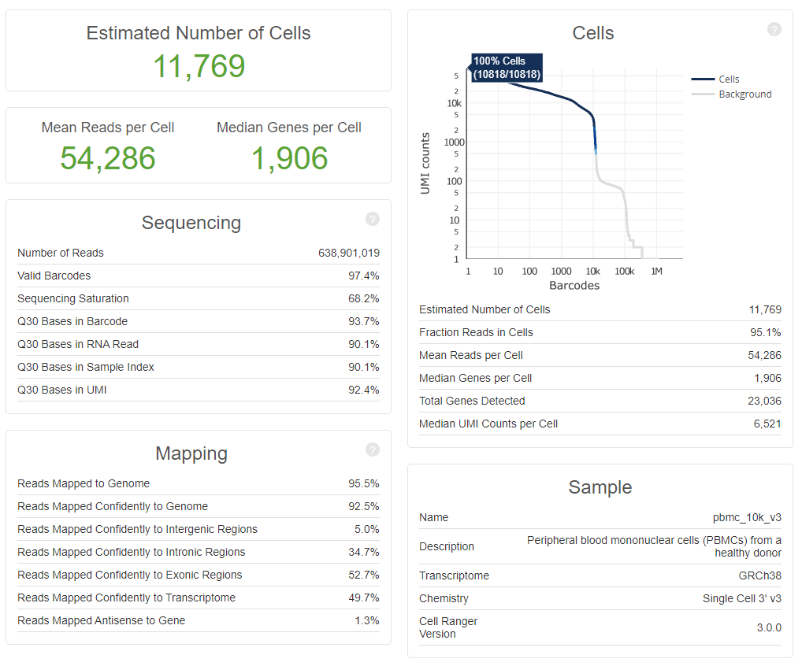
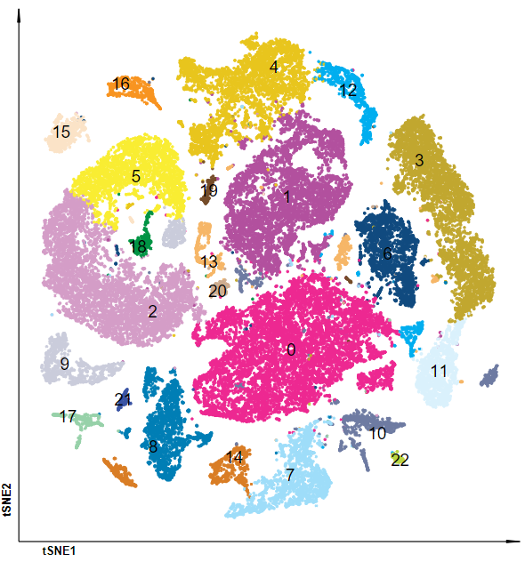
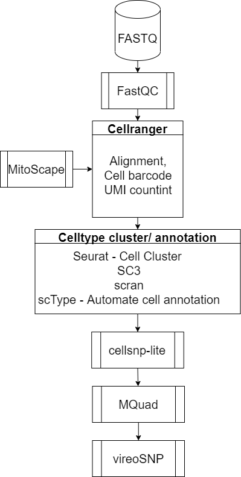

# scRNAseq-MitoVariant
Call MitoVariant from scRNA-seq data

1. Smart-Seq
Smart-seq and Smart-Seq2 are popular protocols for single-cell RNA-sequencing. With these protocols, 96-well plates are used with individual cells placed in each well. To assess the quality of the reads, our pipeline employs FastQC and MultiQC, with checks including distributions of GC-content and levels of adapter contamination. Subsequently, reads are aligned to the appropriate reference genome using STAR, and protein-coding features are quantified with featureCounts program.

2. 10x genomics
10x genomics has developed several protocols for single-cell RNA-sequencing. Unlike Smart-Seq, 10x protocols are droplet-based, and use unique molecular identifiers (UMIs) to avoid counting an RNA fragment more than once. Typically, 10x data contains significantly more cells, sequenced at lower depth, compared to smart-seq. Our pipeline uses FastQC and MultiQC to assess the quality of the raw fastq files before alignment and feature quantification with 10x cellranger software.

## Data

First test PBMC data was source from [Stuart el al., Cell, 2019](https://www.sciencedirect.com/science/article/pii/S0092867419305598?via%3Dihub), scRNA-seq v3 data was downloaded from [10X GENOMICS](https://support.10xgenomics.com/single-cell-gene-expression/datasets/3.0.0/pbmc_10k_v3).

## Data summary of 10k cells

## Seurate cluster

## Pipeline

