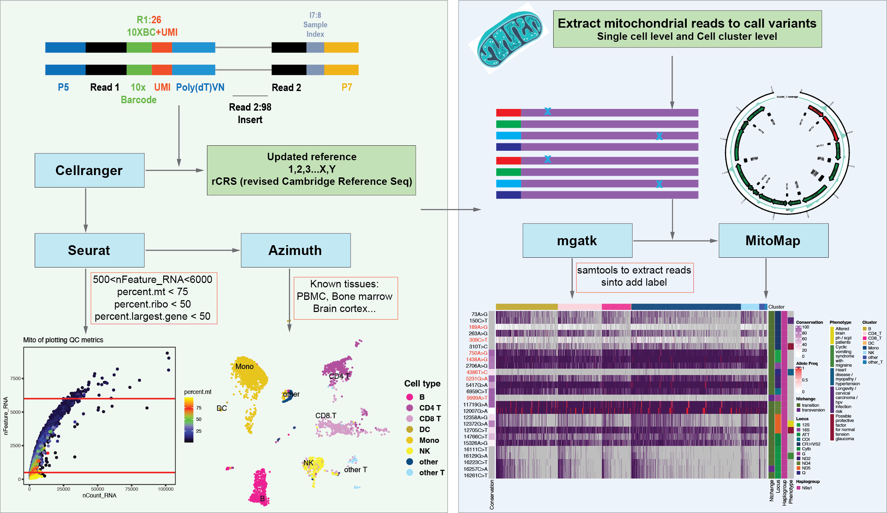

# scMOCHA: Single-Cell Mitochondrial Omics for Cellular Heteroplasmy Analysis
Call mitochondrial mutation from scRNA-seq data

1. Smart-Seq
Smart-seq and Smart-Seq2 are popular protocols for single-cell RNA-sequencing. With these protocols, 96-well plates are used with individual cells placed in each well. To assess the quality of the reads, our pipeline employs FastQC and MultiQC, with checks including distributions of GC-content and levels of adapter contamination. Subsequently, reads are aligned to the appropriate reference genome using STAR, and protein-coding features are quantified with featureCounts program.

2. 10x genomics
10x genomics has developed several protocols for single-cell RNA-sequencing. Unlike Smart-Seq, 10x protocols are droplet-based, and use unique molecular identifiers (UMIs) to avoid counting an RNA fragment more than once. Typically, 10x data contains significantly more cells, sequenced at lower depth, compared to smart-seq. Our pipeline uses FastQC and MultiQC to assess the quality of the raw fastq files before alignment and feature quantification with 10x cellranger software.

## Example data

First test PBMC data was source from [Stuart el al., Cell, 2019](https://www.sciencedirect.com/science/article/pii/S0092867419305598?via%3Dihub), scRNA-seq v3 data was downloaded from [10X GENOMICS](https://support.10xgenomics.com/single-cell-gene-expression/datasets/3.0.0/pbmc_10k_v3).

## Data summary of 10k cells


## Seurate cluster


## Pipeline



## Requrements

> the conda environment includes Seurat and SeuratData, for the cell annotation, when using Azimuth, we need install reference data map by using SeuratData to install corresonpoding reference tissue and cell types.

### Conda environment

```shell

# production mode
conda env create -n scmocha -f scmocha.prod.yaml

# dev mode
conda env create -n scmocha -f scmocha.dev.yaml
```


### Annotation software
> For variant annotation, we need use `cpanm` to install `perl` module `DBD:SQLite`.
```
cpanm DBD::SQLite
```
> Install `haplogrep3` from [here](https://haplogrep.readthedocs.io/en/latest/installation/)

## Singularity or docker image
```bash
singularity pull docker://chunjiesamliu/scmocha:latest
```

## Run WDL workflow with cromwell
> Install `cromwell` with conda

```bash
conda install -c bioconda cromwell

# or download directly from git with https://github.com/broadinstitute/cromwell/releases/download/86/cromwell-86.jar

```
> Run the workflow with cromwell

```bash
module load Java/15.0.1
java -Dconfig.file=/path/to/scMOCHA/config/slurm.conf \
-jar /path/to/cromwell-78.jar \
run scMOCHA.wdl \
-i scMOCHA.inputs.json 1>scMOCHA.log 2>scMOCHA.err
```

> The example scMOCHA.json file
```json
{
  "scMOCHA.partition": "String (optional, default = \"defq\")",
  "scMOCHA.percent_Lagest_Gene_max": "Float (optional, default = 50)",
  "scMOCHA.transcriptome": "String (optional, default = \"/home/liuc9/data/refdata/mgatk_index/Human\")",
  "scMOCHA.mt_features_gmoviz": "File (optional, default = \"/home/liuc9/github/scMOCHA/fasta/mt_features.grange.gmoviz.rds.gz\")",
  "scMOCHA.version": "String (optional, default = \"CellRanger v7.0.1\")",
  "scMOCHA.cpu": "Int (optional, default = 10)",
  "scMOCHA.nFeature_RNA_min": "Int (optional, default = 200)",
  "scMOCHA.reso": "Float (optional, default = 0.1)",
  "scMOCHA.chrM": "String (optional, default = \"MT\")",
  "scMOCHA.jar_path": "File (optional, default = \"/scr1/users/liuc9/tools/haplogrep3\")",
  "scMOCHA.use_ssd": "Boolean (optional, default = false)",
  "scMOCHA.low_coverage_threshold": "Int (optional, default = 10)",
  "scMOCHA.output_id": "String",
  "scMOCHA.scmocha_version": "String (optional, default = \"latest\")",
  "scMOCHA.use_mitoscape": "Boolean (optional, default = false)",
  "scMOCHA.output_dir": "String",
  "scMOCHA.bindir": "String (optional, default = \"/home/liuc9/github/scMOCHA/bin\")",
  "scMOCHA.celllevel": "String",
  "scMOCHA.disk_space": "String (optional, default = \"50\")",
  "scMOCHA.boot_disk_size_gb": "Int (optional, default = 12)",
  "scMOCHA.percent_mt_max": "Float (optional, default = 75)",
  "scMOCHA.mt_exons_df": "File (optional, default = \"/home/liuc9/github/scMOCHA/fasta/mt_exons.df.rds.gz\")",
  "scMOCHA.docker": "String (optional, default = \"chunjiesamliu/scmocha\")",
  "scMOCHA.perlscript": "File (optional, default = \"/home/liuc9/github/scMOCHA/bin/get_variants_info.pl\")",
  "scMOCHA.IMAGE": "File (optional, default = \"/scr1/users/liuc9/sif/scmocha_latest.sif\")",
  "scMOCHA.percent_ribo_max": "Float (optional, default = 50)",
  "scMOCHA.conda_env": "String (optional, default = \"scmocha\")",
  "scMOCHA.fastqs": "String",
  "scMOCHA.rCRS": "File (optional, default = \"/home/liuc9/github/scMOCHA/fasta/rCRS.MT.fasta\")",
  "scMOCHA.sqlite_path": "File (optional, default = \"/mnt/isilon/xing_lab/liuc9/refdata/mitomaster/mitomap_sqlite_20230525.sqlite3\")",
  "scMOCHA.conda_root": "String (optional, default = \"/home/liuc9/tools/anaconda3\")",
  "scMOCHA.sample_id": "String",
  "scMOCHA.cellrefname": "String",
  "scMOCHA.npcs": "Int (optional, default = 10)",
  "scMOCHA.nFeature_RNA_max": "Int (optional, default = 8000)",
  "scMOCHA.memory": "String (optional, default = \"50 GB\")",
  "scMOCHA.account": "String (optional, default = \"liuc9\")"
}

```

## Run scMOCHA WDL with singularity or docker
> singularity example
```bash
module load Java/15.0.1
java -Dconfig.file=/path/to/singularity.slurm.conf \
-jar /path/to/cromwell-78.jar \
run /path/to/scMOCHA/scMOCHA.image.wdl \
-i scMOCHA.inputs.json 1>scMOCHA.log 2>scMOCHA.err
```
