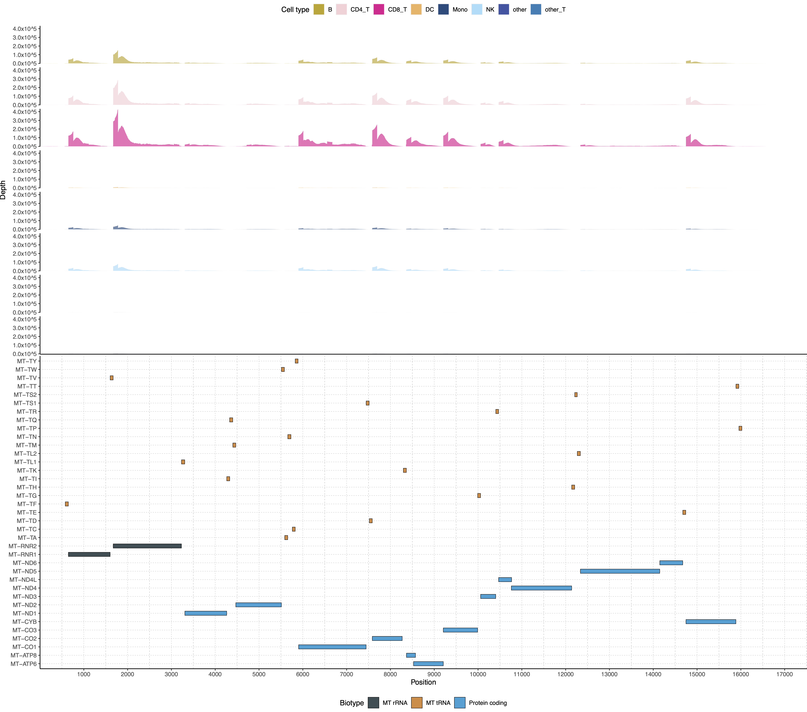
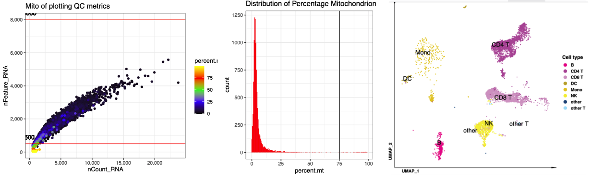
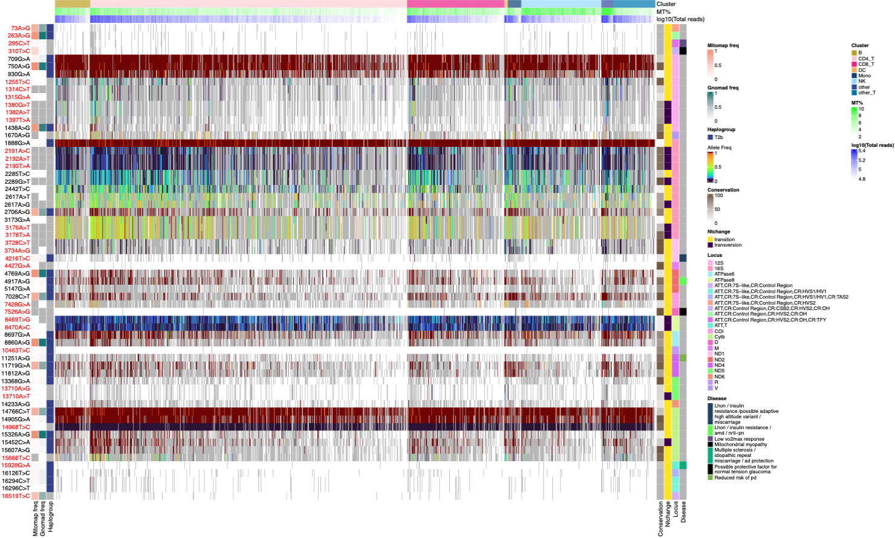
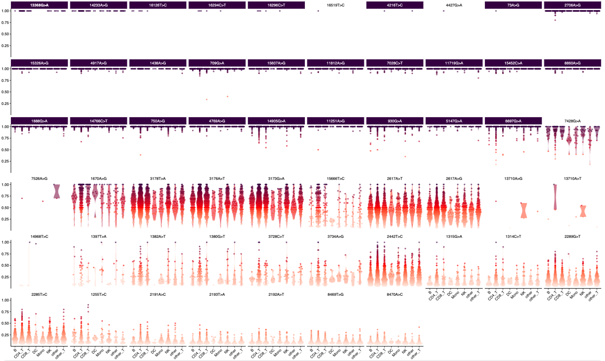

# scMOCHA: Single-Cell Mitochondrial Omics for Cellular Heteroplasmy Analysis

## Table of Contents

- [1. About scMOCHA](#1-about-scmocha)
- [2. Installation](#2-installation)
  - [2.1 Prerequisites](#21-prerequisites)
  - [2.2 Prepare reference for Cell Ranger](#22-prepare-reference-for-cell-ranger)
  - [2.3 Variant annotation requirements](#23-variant-annotation-requirements)
  - [2.4 Install latest scMOCHA](#24-install-latest-scmocha)
  - [2.5 R package installation](#25-r-package-installation)
  - [2.6 Docker image](#26-docker-image)
- [3. Run scMOCHA](#3-run-scmocha)
  - [3.1 scMOCHA.inputs.json](#31-scmochainputsjson)
  - [3.2 Example data](#32-example-data)
  - [3.3 Outputs](#33-outputs)
    - [3.3.1 Cell Ranger summary](#331-cell-ranger-summary)
    - [3.3.2 Cell QC and clustering](#332-cell-qc-and-clustering)
    - [3.3.3 Cell level heteroplasmy](#333-cell-level-heteroplasmy)

## 1. About scMOCHA

scMOCHA is an end-to-end pipeline for calling mitochondrial mutations from single-cell RNA-seq data. The pipeline is designed to work with multi-version 10x Genomics data, and includes quality control, alignment, cell clustering, and variant calling on single cell and cluster level, variant annotation steps. The pipeline is implemented in [Workflow Description Language (WDL)](https://github.com/openwdl/wdl), and can be run on a local machine, a high-performance computing cluster and a computing cloud.


## 2. Installation

The scMOCHA workflow is implemented in WDL, and can be run with Cromwell. The pipeline requires a Conda environment to manage software dependencies. Before running the pipeline, users need to install the required software and download the necessary reference data.

### 2.1 Prerequisites

- [Conda](https://docs.conda.io/en/latest/miniconda.html) for managing software dependencies.
- [Cromwell](https://cromwell.readthedocs.io/en/latest/) for running scMOCHA WDL workflows.
- [Java](https://www.java.com/en/download/) for running Cromwell and halpogrep3.
- [Cell Ranger](https://support.10xgenomics.com/single-cell-gene-expression/software/pipelines/latest/what-is-cell-ranger) for processing 10x Genomics data.
- [HyperSQL](https://hsqldb.org) for rezuming the scMOCHA pipeline (Optional).

### 2.2 Prepare reference for Cell Ranger

The reference data for Cell Ranger can be downloaded from the 10x Genomics website. The reference data is required for the alignment step in the scMOCHA pipeline. The reference data can be downloaded from the 10x Genomics website using the following command.

The [Revised Cambridge Reference Sequence (rCRS)](https://www.mitomap.org/foswiki/bin/view/MITOMAP/HumanMitoSeq) is the reference genome for human mitochondrial DNA. **Users need to replace mitochondrial reference with the rCRS reference data for the Cell Ranger reference index.**

```shell
cellranger mkref \
  --genome=rCRS_cellranger \
  --fasta=/path/to/Homo_sapiens.GRCh38.updated.rCRS.fasta \
  --genes=/path/to/Homo_sapiens.GRCh38.107.MT.gtf \
  --nthreads=50 \
  --memgb=200
```

### 2.3 Variant annotation requirements

We put [MITOMAP](https://www.mitomap.org/MITOMAP) variant annotation references into a SQLite database for annotation. Users can download the our prepared SQLite database from [here](https://mitomap.org/downloads/mitomap_sqlite.db).

For variant annotation, users need use perl package management software `cpanm` to install `perl` module `DBD:SQLite`.

```
cpanm DBD::SQLite
```

Download and install `haplogrep3` from [here](https://haplogrep.readthedocs.io/en/latest/installation/).

### 2.4 Install latest scMOCHA

```shell
git clone git@github.com:chunjie-sam-liu/scMOCHA.git
cd scMOCHA
conda env create -n scmocha -f scmocha.prod.yaml
conda activate scmocha
```

### 2.5 R package installation

The `scmocha` conda environment can be created by [scmocha.prod.yaml](./scmocha.prod.yaml), it includes python and R packages. Some of R packages are not deposited in the conda repositories. Users should verify whether the following packages are installed. If not, they can be installed using the commands provided below.

```R
# install R packages
install.packages("BiocManager")
the_packages <- c("Seurat", "SeuratData", "patchwork", "rlang", "ggplot2", "magrittr", "gggenes", "gmoviz", "ComplexHeatmap", "devtools", "httr", "logger", "GetoptLong")
BiocManager::install(the_packages)

devtools::install_github("dzhang32/ggtranscript")
devtools::install_github('satijalab/azimuth', ref = 'master')
```


### 2.6 Docker image

We containerized the scMOCHA environment with docker image. Users can donwload the docker image from [Docker Hub](https://hub.docker.com/r/chunjiesamliu/scmocha).

```shell
docker pull docker://chunjiesamliu/scmocha:latest
# or singularity pull sif image
singularity pull docker://chunjiesamliu/scmocha:latest
```

## 3. Run scMOCHA

After installing the required software and downloading the necessary reference data, users can run the scMOCHA pipeline with Cromwell. The pipeline requires a JSON file with the input parameters for the pipeline. The JSON file should include the following parameters:

```bash
java -Dconfig.file=/path/to/scMOCHA/config/slurm.conf \
  -jar /path/to/cromwell-78.jar \
  run scMOCHA.wdl \
  -i scMOCHA.inputs.json 1>scMOCHA.log 2>scMOCHA.err
```

### 3.1 scMOCHA.inputs.json

```json
{
  "scMOCHA.partition": "String (optional, default = \"defq\")",
  "scMOCHA.percent_Lagest_Gene_max": "Float (optional, default = 50)",
  "scMOCHA.transcriptome": "String (optional, default = \"/path/to/data/refdata/mgatk_index/Human\")",
  "scMOCHA.mt_features_gmoviz": "File (optional, default = \"/path/to/github/scMOCHA/fasta/mt_features.grange.gmoviz.rds.gz\")",
  "scMOCHA.version": "String (optional, default = \"CellRanger v7.0.1\")",
  "scMOCHA.cpu": "Int (optional, default = 10)",
  "scMOCHA.nFeature_RNA_min": "Int (optional, default = 200)",
  "scMOCHA.reso": "Float (optional, default = 0.1)",
  "scMOCHA.chrM": "String (optional, default = \"MT\")",
  "scMOCHA.jar_path": "File (optional, default = \"/path/to/haplogrep3\")",
  "scMOCHA.use_ssd": "Boolean (optional, default = false)",
  "scMOCHA.low_coverage_threshold": "Int (optional, default = 10)",
  "scMOCHA.output_id": "String",
  "scMOCHA.scmocha_version": "String (optional, default = \"latest\")",
  "scMOCHA.use_mitoscape": "Boolean (optional, default = false)",
  "scMOCHA.output_dir": "String",
  "scMOCHA.bindir": "String (optional, default = \"/path/to/github/scMOCHA/bin\")",
  "scMOCHA.celllevel": "String",
  "scMOCHA.disk_space": "String (optional, default = \"50\")",
  "scMOCHA.boot_disk_size_gb": "Int (optional, default = 12)",
  "scMOCHA.percent_mt_max": "Float (optional, default = 75)",
  "scMOCHA.mt_exons_df": "File (optional, default = \"/path/to/github/scMOCHA/fasta/mt_exons.df.rds.gz\")",
  "scMOCHA.docker": "String (optional, default = \"chunjiesamliu/scmocha\")",
  "scMOCHA.perlscript": "File (optional, default = \"/path/to/github/scMOCHA/bin/get_variants_info.pl\")",
  "scMOCHA.IMAGE": "File (optional, default = \"/path/to/sif/scmocha_latest.sif\")",
  "scMOCHA.percent_ribo_max": "Float (optional, default = 50)",
  "scMOCHA.conda_env": "String (optional, default = \"scmocha\")",
  "scMOCHA.fastqs": "String",
  "scMOCHA.rCRS": "File (optional, default = \"/path/to/github/scMOCHA/fasta/rCRS.MT.fasta\")",
  "scMOCHA.sqlite_path": "File (optional, default = \"/path/to/refdata/mitomap/mitomap_sqlite.db\")",
  "scMOCHA.conda_root": "String (optional, default = \"/path/to/tools/anaconda3\")",
  "scMOCHA.sample_id": "String",
  "scMOCHA.cellrefname": "String",
  "scMOCHA.npcs": "Int (optional, default = 10)",
  "scMOCHA.nFeature_RNA_max": "Int (optional, default = 8000)",
  "scMOCHA.memory": "String (optional, default = \"50 GB\")",
  "scMOCHA.account": "String (optional, default = \"userID\")",
  "scMOCHA.chemistry":"String (optional, default = \"auto\")",
  "scMOCHA.x10_version":"String"
}
```

### 3.2 Example data

The test scRNA-seq v3 data can be downloaded from [10X GENOMICS](https://support.10xgenomics.com/single-cell-gene-expression/datasets/3.0.0/pbmc_10k_v3). Then prepare the `scMOCHA.inputs.json` file and follow the [Run scMOCHA](#3-run-scmocha) section to run the pipeline.

### 3.3 Outputs
The output files generated by scMOCHA will be stored in <output_dir>, as specified by the user in the JSON file. The outputs are organized into three main categories:
#### 3.3.1 Cell Ranger summary
It will provides a summary on each sample, including estimated cell numbers, mean reads per cell, median genes per cell, total reads, Q30 bases, and read mapping quality.


#### 3.3.2 Cell QC and clustering
The main output for this section includes:
**(1) plot-qc.pdf:** displays the distribution of mitochondrial content, ribosomal content, and the largest gene percentage.
 **(2) plot-metrics.pdf:** shows a QC plot, including the distribution of mitochondrial and ribosomal content.
 **(3) plot-mt-cluster-depth.pdf:** displays the depth of mtDNA sequencing across each cell type.
 **(4) plot-umap.pdf:** displays the UMAP and cell type classifications.
 **(5) plot-pie-celltype.pdf and celltype_ratio.tsv:** show the composition of each cell type.
 **(6) sc_azimuth.rds.gz:** contains the processed data from Seurat or Azimuth analysis.







#### 3.3.3 Cell level heteroplasmy
This section contains variant calling results at both the cluster and single-cell levels, distinguishable by the file names that start with either "cell" or "cluster". Main output files include:
**(1) cluster_af_heatmap.pdf and cluster_cell_af_heatmap.pdf:** display heatmaps of allele frequency at both the cluster and single-cell levels.
 **(2) cluster_depth_heatmap.pdf and cluster_cell_depth_heatmap.pdf:** show heatmaps of sequencing depth at the cluster and single-cell levels.
**(3) cell_variant_annotation.xlsx and cell_variant_annotation.tsv**: provide detailed information for each variant identified by the pipeline at the single cell level




